# Eco Bike Hire 

## Table of Contents

- [Team Members](#team-members)
- [Links to our project](#links-to-our-project)
- [Concept](#concept)
- [User Story](#user-story)
- [Technologies and Packages](#technologies-and-packages)
- [Screenshots](#screenshots)
- [Installation](#installation)
- [Usage](#usage)
- [Development Environment](#development-environment)

## Team Members

- Faisal Mohammed
- Abu Saddique
- Smeea Arshad
- Abdinasir Warsame
- Nayan Sharma
- Amal Idris

## Project Links

- Deployed URL: https://eco-bike-hire.herokuapp.com/
- Github repo: https://github.com/faisal244/eco-bike-hire
- Presentation: https://docs.google.com/presentation/d/13-SYwvsC2lvPPvAUY7Nbtvjf9iwfKEqcc0zCE86k7TQ/edit#slide=id.p
<!-- - Video Walkthrough:  -->

## Concept

### A cleaner, healthier, happier world is possible, one pedal at a time.

Most journeys made in a car are for less than for distances of 5 miles or less. In fact, in the UK, of the journeys of 1-5 miles, over 80% are made by car. Cars produce .97 pounds of pollution per mile; bikes produce none. Bikes are also up to 50% faster than cars during rush hour.

Eco Bike Project was started because of our interest in environmental issues around pollution, sustainability and a heathier living space.

## User Story

```
AS A person in need of a eco friendly mode of transportation
I WANT to be able to view different types of bicycles i could temporarily rent to fulfil my short term travel requirements

I WANT to be able to view and manage my booking details after i have made a booking
SO THAT I can view and/or amend the start and end dates of my bookings, and view the total cost.

I WANT to be able to sign up/login and manage my bookings
SO THAT i can view, update and delete my bookings

WHEN I login
THEN my session is saved and i can view the private navbar

WHEN I logout
THEN my session is deleted and i can no longer see the private navbar

WHEN I book a bike
THEN save my booking in the database, so that i can view it later

WHEN a user signs up
THEN the users details are saved in the database

WHEN a bike is rented
THEN it is updated in the inventory in the database

WHEN a bike is out of stock
THEN the database alerts the user that it is out stock

WHEN a booking is confirmed
THEN it is updated on the database
```

## Technologies and Packages

- Javascript
- Node.JS
- Express.js
- Bcrypt
- Dotenv
- MySQL2
- Sequelize
- Handlebars.js
- Express-Session
- Connect-Session-Sequelize
- Moment
- Bootstrap
- jQuery
- Font Awesome

## Screenshots


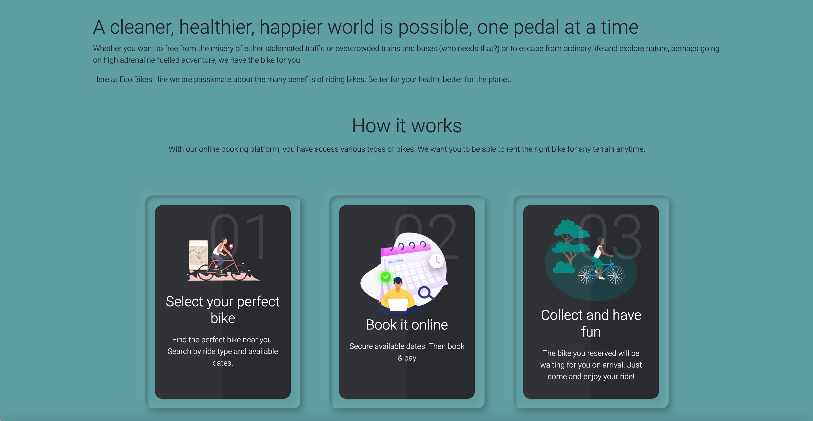

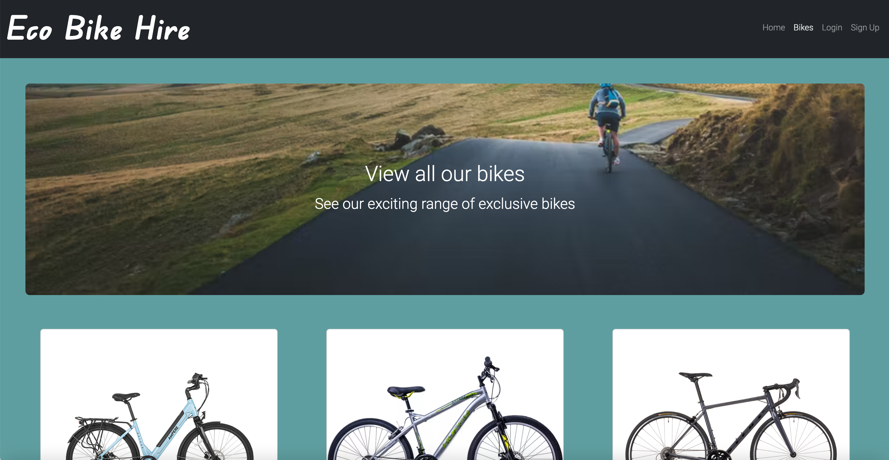

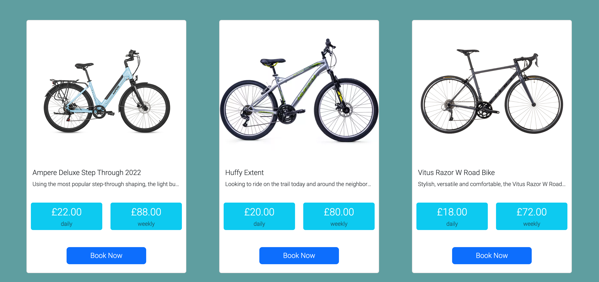

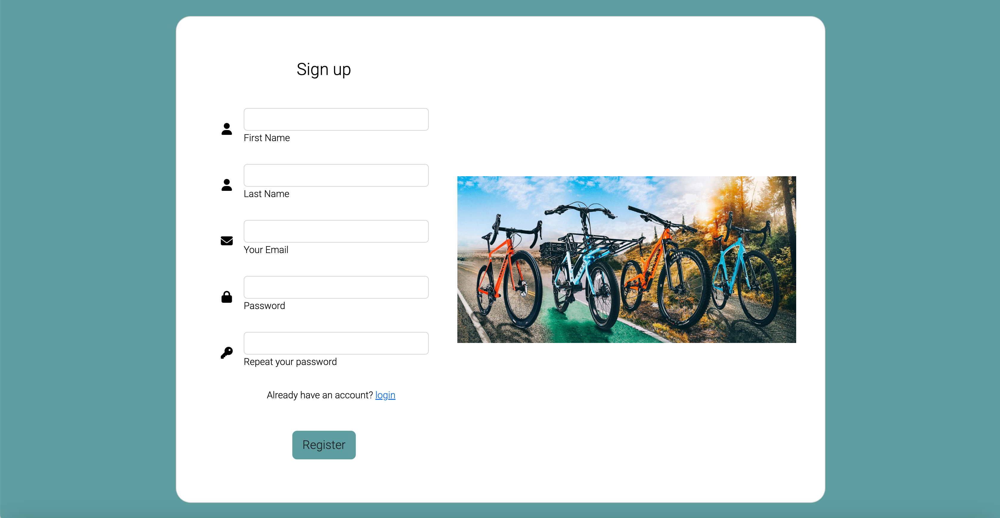

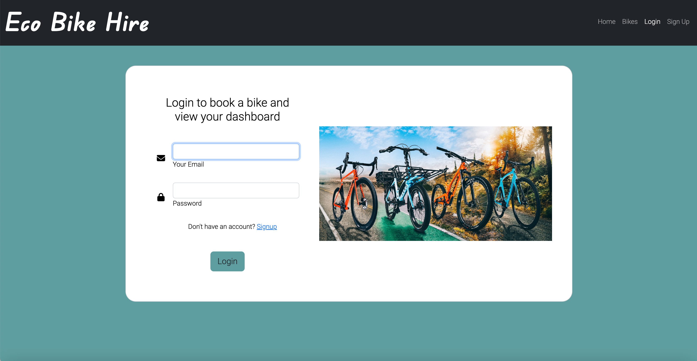

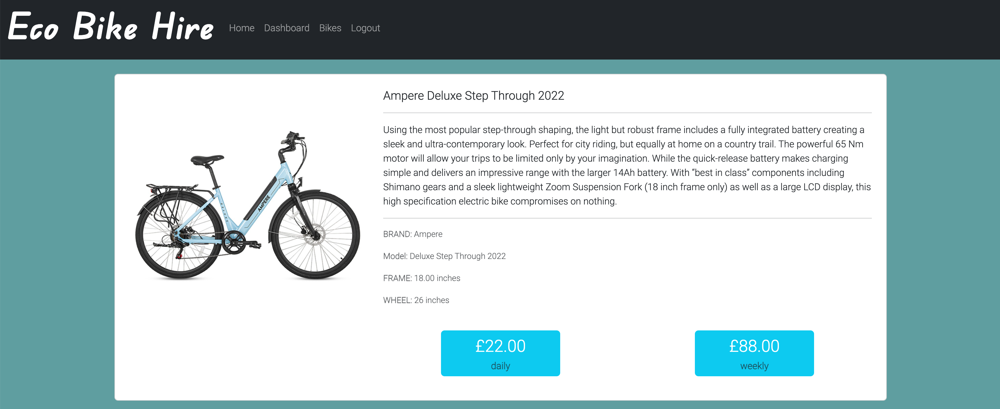

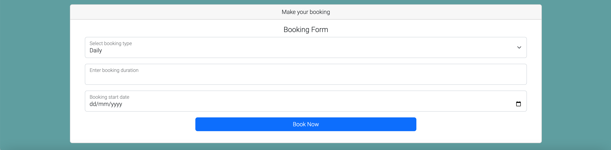

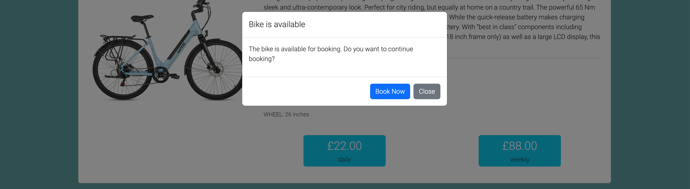

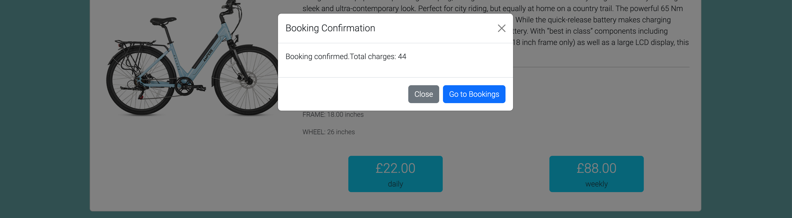

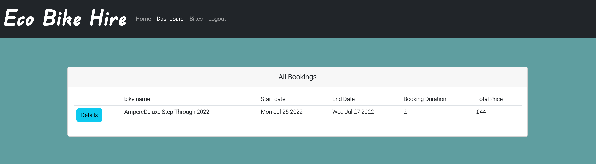

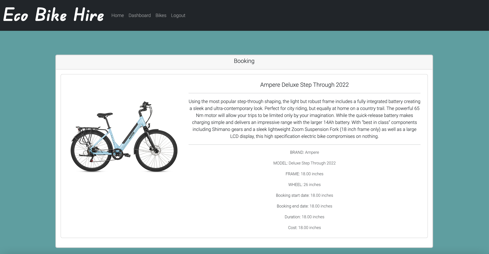

## Installation

The application can be invoked by entering the following 3 commands line by line into your terminal / CLI

```

git clone git@github.com:faisal244/eco-bike-hire.git
cd eco-bike-hire
npm install

```

## Usage

Once all the dependencies have been installed, please provide the application with the source database schema by entering the following 2 commands in your terminal:

```
mysql -u root -p
When promoted for a password, enter "password"
```

then type:

```

source [enter absolute file path for the provided schema.sql file in the /src/db folder here]

```

type quit to exit the MySQL shell.

Once the source database schema has been provided, please execute the following command in your terminal to both seed the database with employee data and start the server to run this application:

```

npm run start


```

You can then press ctrl+click on the link that appears in your terminal to launch the application (or cmd+click if you are using MacOS).

Alternatively, please navigate to http://localhost:4000/ in your browser to use this application.

This application has also been deployed to Heroku cloud Infrastructure and can be accessed directly and immediately by clicking the following link:

https://eco-bike-hire.herokuapp.com/

## Development Environment

- VScode
- Terminal
- Express
- Nodemon
- MacOS Monterey
- Windows 11
- Git
- Github

---
